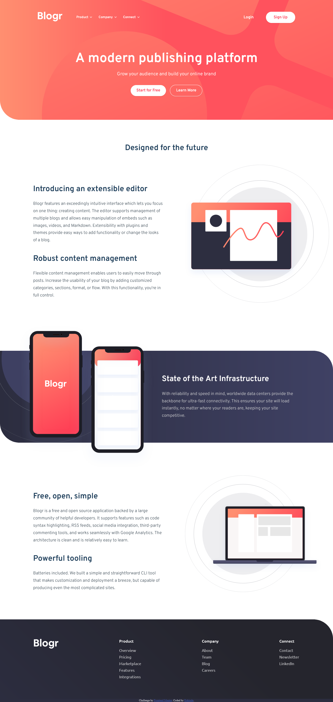

# Frontend Mentor - Blogr landing page solution

This is a solution to the [Blogr landing page challenge on Frontend Mentor](https://www.frontendmentor.io/challenges/blogr-landing-page-EX2RLAApP). Frontend Mentor challenges help you improve your coding skills by building realistic projects.

## Table of contents

- [Overview](#overview)
  - [The challenge](#the-challenge)
  - [Screenshot](#screenshot)
  - [Links](#links)
- [My process](#my-process)
  - [Built with](#built-with)
  - [What I learned](#what-i-learned)
  - [Continued development](#continued-development)
  - [Useful resources](#useful-resources)
- [Author](#author)
- [Acknowledgments](#acknowledgments)

## Overview

### The challenge

Users should be able to:

- View the optimal layout for the site depending on their device's screen size
- See hover states for all interactive elements on the page

### Screenshot




### Links

- Solution URL: [Solution on Github](https://github.com/jonathan401/FEM-blogr-landing-page)
- Live Site URL: [Live demo deployed using vercel](https://fem-blogr-landing-page-262o.vercel.app/)

## My process

- I started out by structuring out the page content in HTML. This helped me create a mental map of how each section of the page were related and also added classnames using the BEM methodology.

- After structuring the html, I then proceeded to add styling using SCSS trying to work my way down the document. I applied the Mobile-first workflow although I had to go with the desktop first-workflow for the navigation (particularly the accordions) because I felt it was easier to build out the accordion for larger screens since it required less styling compared to the mobile view.

- To create the accordion and nav menu button functionality, I used html custom data attributes and aria values to toggle the visibilty of the accordion content and navigation meny respectively.

- A skip link was also included to help users navigate easily to the main content without having to go through the navigation menu if they so desired.

- SCSS Document structure:
  - abstracts - to hold global app variables
  - components - to hold resuabe components
  - regions - to hold sections of the website

### Built with

- Semantic HTML5 markup
- CSS custom properties
- Flexbox
- CSS Grid
- Mobile-first workflow
- SCSS For styling

### What I learned

- This project challenged my stying skills. I had previously built it out using 'vanilla CSS' but the code became too long and hard for me to understand. So I decided to use SCSS which made it so much easier to break up the project into chunks that was easy to understand.

- One particular part of the project that got me almost frustrated was the feature section. An image is provided below:
  

I had initially tried using CSS abosolute positioning to recreate it but discovered that I'll have to undo and write a lot of styles to make sure that the desktop version was close to the design. So I used CSS grid which turned out to be the best solution I found to creating overlapping content. The code below:

```scss
 &--stacked {
    display: grid;

    & > * {
      grid-area: 1 / -1;
    }
```

creates a grid and the line `& > *` makes all children in the grid fill the grid space, making them overlap, I used margins to create the spaces between both contents in the grid. To add the background image provided in the design, I had to add an empty `div` element to serve as the 'back' of the feature card, I had tried using the `::after` psuedo element for this but it did not work out.

- When using BEM, I discovered that my block structure was becoming increasingly complex. For example:

```html
<nav class="nav">
  <a href="#" class="nav__home-link">Site name</a>
  <ul class="nav__link-list">
    <li class="nav__link-list-item">
      <a href="#" class="nav__link-list-item-link">link</a>
    </li>
  </ul>
</nav>
```

But then, going through the docs, I learned that I should make elements which are nested dependent on the body as opposed to extending elements names within elements. So the code above becomes something like:

```html
<nav class="nav">
  <a href="#" class="nav__home-link">Site name</a>
  <ul class="nav__link-list">
    <li class="nav__item">
      <a href="#" class="nav__link">link</a>
    </li>
  </ul>
</nav>
```

### Continued development

Use this section to outline areas that you want to continue focusing on in future projects. These could be concepts you're still not completely comfortable with or techniques you found useful that you want to refine and perfect.

- This project made me realize I need to learn more about the CSS grid and how I could use it to create more complex and interesting.

- I'll also want to use more features of SCSS to make development better.

- I used gulp to convert the SCSS files to CSS and the Javascript to browser-compatible Javascript using babel. I really don't understand how it works. A major issue I faced during development was that I had to refresh the browser to see the changes made in the document reflect in the browser. I read online but really didn't find a way to go about it. Your help will be appreciated.

### Useful resources

- [BEM](https://getbem.com/faq/#css-nested-elements) - This provided a solid structure to understand how BEM works.
- [Overlapping content with CSS Grid](https://youtu.be/ncPwkE10BOY?si=u9QKUNmxOHbqCqVM) - A youtube short by Kevin Powell that shows how to overlap content with CSS Grid.
- [BEM Grandchildren: How To Handle Deeply Nested Elements](https://scalablecss.com/bem-nesting-grandchild-elements/) - This article helped me understand how to properly handle when elements start to get deeply nested within a block.

## Author

- Frontend Mentor - [@jonathan401](https://www.frontendmentor.io/profile/jonathan401)

## Acknowledgments

I'll really love to thank [@Karolbanat](https://github.com/karolbanat) - his [news homepage solution](https://github.com/karolbanat/news-homepage) particularly the SCSS, served as a guide in using SCSS, I was constantly checking how he structured his SCSS files and how to map in SCSS.

[@Anagkazou's](https://github.com/anagkazou) [Hotel Larbida app](https://github.com/anagkazou/Hotel-Larbida) also provided a guide.

The [Sass site source code](https://github.com/sass/sass-site/tree/main/source) was also helpful.
